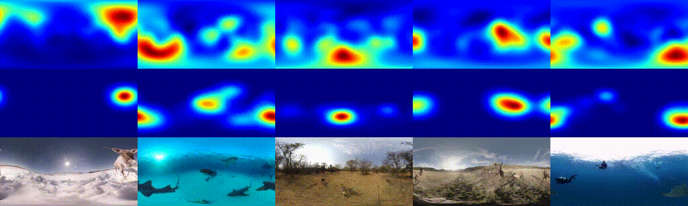
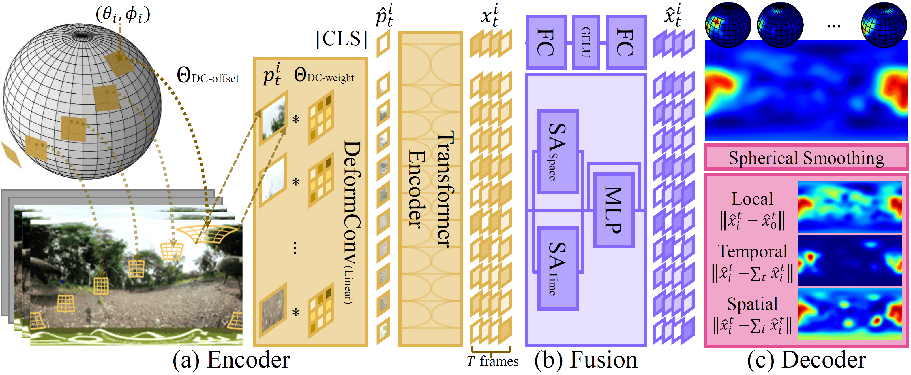

# PAVER

Official repository of Panoramic Vision Transformer for Saliency Detection in 360 Videos (ECCV 2022)



### [[Paper]](https://www.ecva.net/papers/eccv_2022/papers_ECCV/html/7174_ECCV_2022_paper.php) [[Poster]](https://hs-yn.github.io/assets/pdf/2022eccv_paver_poster.pdf)


## Getting Started

1. To create a virtual environment with all relevant libraries installed:

```bash
conda env create -f environment.yml
```

2. Dataset will be stored under the `data` directory by default. First, create a symbolic link at your convenience:

```bash
ln -s /some/path/to/data data
```

3. The `data` directory should be organized as follows. Since the Wild360 dataset is available upon request, you may ask for access [here](http://aliensunmin.github.io/project/360saliency/).

```bash
data
├─ wild360                # the dataset should be downloaded on your own
│  ├─ data/{test,train}
│  └─ Wild360_GT_29
├─ cache                  # cache features for fast experiments
└─ log                    # training log & weights
```


## How to Run



### Training

Provided the dataset and environment are all prepared, simply run the command below:

```bash
python cli.py
```

Default configurations can be found in `config.py` and `configs/*/*.json`. To override parameters at your disposal:

```bash
python cli.py with max_epoch=10
```


### Inference

You can download our model weight [here](https://drive.google.com/file/d/11UIxfGkVLHjgG1VJFwOJ1jPPIorhqrPI/view?usp=share_link).

```bash
python cli.py demo with {some_necessary_parameters}
```


### Adapting PAVER for ViT Variants

Adapting PAVER for ViT variants is quite simple. Provided the target ViT uses `PatchEmbed`, all you need to do is to replace it with a deformable counterpart using `compute_deform_offset` in `geometry.py`.

```python
# (...)
from geometry import compute_deform_offset

class DeformPatchEmbed(nn.Module):
    def __init__(self, ...):
        # (...)
        self.proj = DeformConv2d(in_chans, embed_dim, kernel_size=patch_size, stride=patch_size)
        offset = torch.from_numpy(compute_deform_offset(model_config=model_config,
                                                        is_discrete=is_discrete)).float()
        self.register_buffer('offset', offset)
        # (...)

class DeformViTVariant(ViT):
    def __init__(self, ...):
        # (...)
        self.patch_embed = DeformPatchEmbed(...)
        # (...)
```

Please refer to `model/ViT.py` for detailed usage.


## Citation

If you find our work useful in your research, please consider citing:

```bibtex
@InProceedings{
    author    = {Yun, Heeseung and Lee, Sehun and Kim, Gunhee},
    title     = {Panoramic Vision Transformer for Saliency Detection in 360 Videos},
    booktitle = {ECCV},
    year      = {2022}
}
```